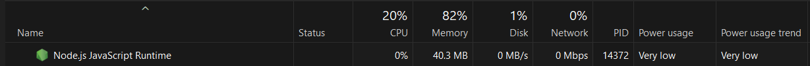

# CHANGELOG - BLACKHOLE

## v0.0.1

* Initial commit for blackhole.
* Uses nextjs.
* Shows Live DNS queries.

## v0.0.2

* Second release of blackhole.
* Removed usage of nextjs and moved to ejs.
* Removed ability to store and update all the adlist in a `Map` to querying on the spot.
* Memory usage reduced from approx. above 700MB to approx. below 200MB.
* Now has ability to block or unblock domains from input box.
* Live DNS queries can be viewed from `/admin`

## v0.0.3

* Insert domains into the database, if the databse is freshly created
* Remove all the nextjs related files

## v0.0.4

* Updated the file & folder structure for the entire project
* Add a nice way to build the project inside the `/build` directory
* Compiled version of blackhole now runs in less than 50MB after a minute or so

## v0.1.0

* Removed all custom css and replaced with bootstrap
* Made block/allowed list to be compactable with import from different domain lists

